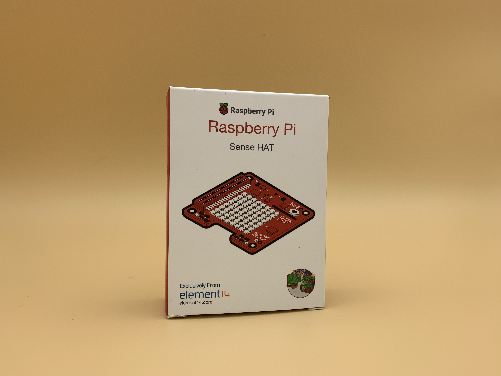
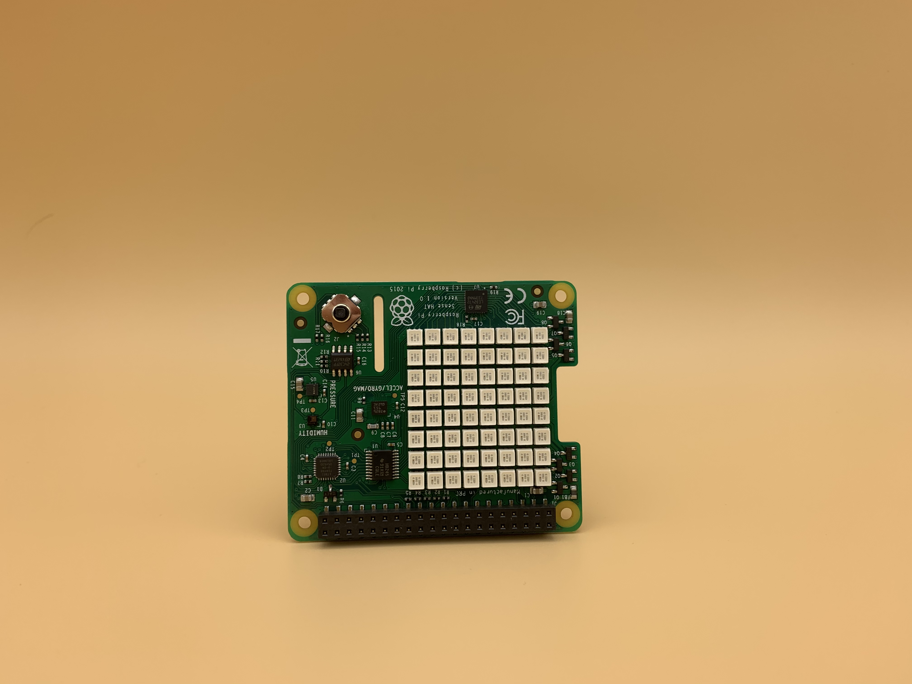
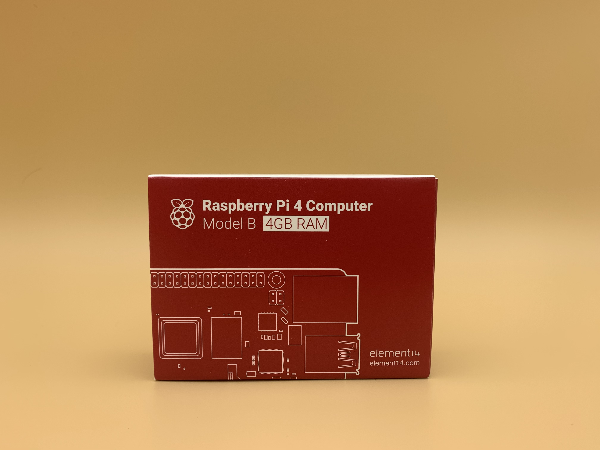
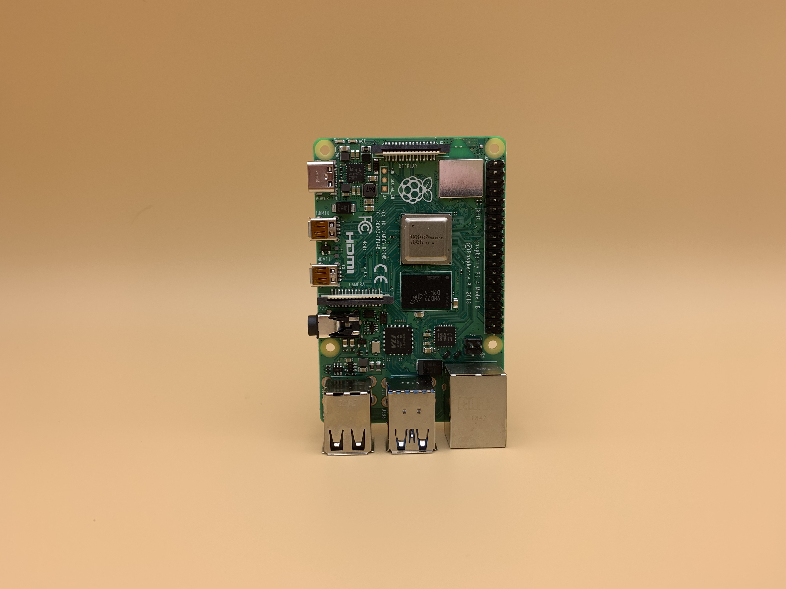
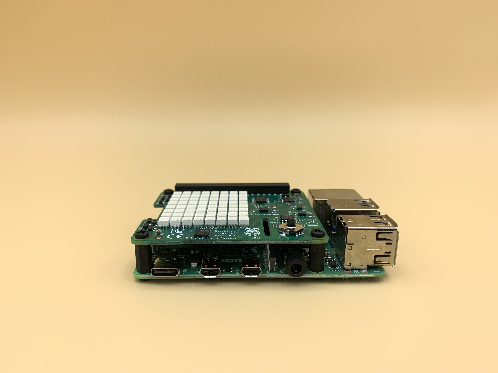
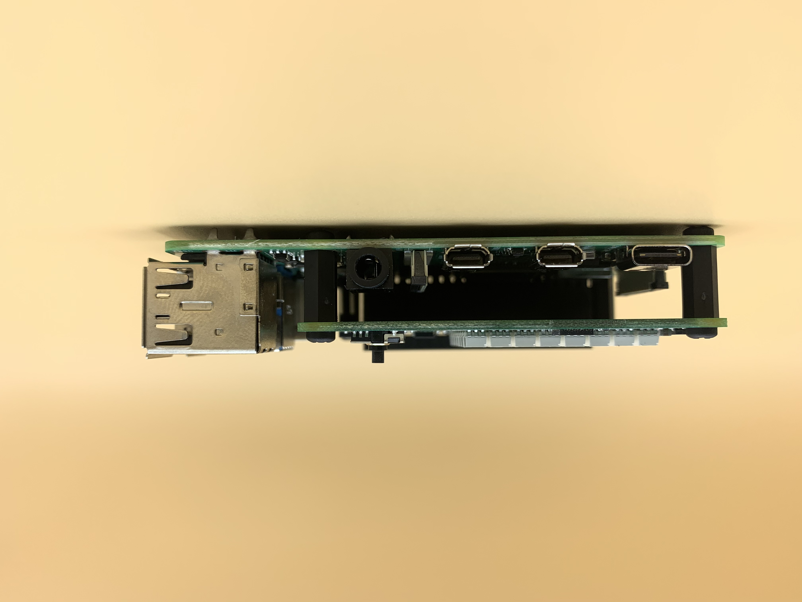
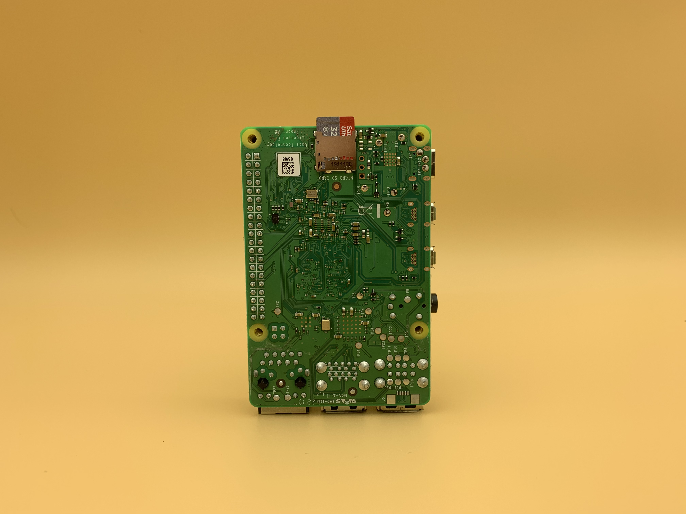

# IoT Scripts

Authors: Hunter Mason, Ryan O'Connor

This package is a suite of scripts to be used with the Raspberry Pi. Initially this was intended to be used for Ryan's IoT Class, but it has grown and expanded to also included several useful scripts for Atlas Scientific Sensors that have been co-developed with Hunter Mason from Seattle University. 


## Configuring Package for Splunk

This package expects you to create one file inside of the scripts directory called 'splunk_server.conf'. The following script should help you create that file. 

```
cd iot_class_scripts/
mkdir local/
cp splunk_server.conf local/
```

Once you've created the file, fill in the approprate sections. Below are definitions for each key. 

token = Your HTTP Event Collector Token

url = The URL for the HTTP Event Collector Running in Splunk

owner = The owner for the current device. If this doesn't apply, simply leave it blank.

index = The index you want your data to reside in. 

## Configuring TP-Link Script

This package allows you to query multiple TP-Link HS110 Devices. You can screate a tplink.conf file inside of the local directory as well. There is a sample file called tplink.conf that will show you how to configure this. 

```
cd iot_class_scripts/
mkdir local/
cp tplink.conf local/
```

Once you have the file in place, created a comma separated entry on each line for IP Address and hostname as shown in the file. 


## Building Projects

### Example Service

```
[Unit]
Description=My Toggle Button Service for Sense HAT
After=network.target

[Service]
ExecStart=/usr/bin/python3 -u /home/pi/iot_class_scripts/toggle.py
WorkingDirectory=/home/pi/iot_class_scripts/
StandardOutput=inherit
StandardError=inherit
Restart=always
User=pi

[Install]
WantedBy=multi-user.target
```

### Working with service

#### Add a new service file:

`vim /etc/systemd/system/sensehat-toggle.service`

#### Reload systemctl daemon

`systemctl daemon-reload`

#### Start service on boot

`systemctl enable sensehat-toggle`

#### Useful commands for services

Restart Service
`systemctl restart sensehat-toggle`

Start Service
`systemctl start sensehat-toggle`

Stop Service
`systemctl stop sensehat-toggle`


### Using the Sense HAT

This Sensor can be used with weather.py and toggle.py

#### Step 1:
</img>
#### Step 2:
</img>
#### Step 3:
</img>
#### Step 4:
</img>
#### Step 5:
</img>
#### Step 6:
</img>
#### Step 7:
</img>
#### Step 8:
</img>
#### Step 9:
</img>
#### Step 10:
</img>
